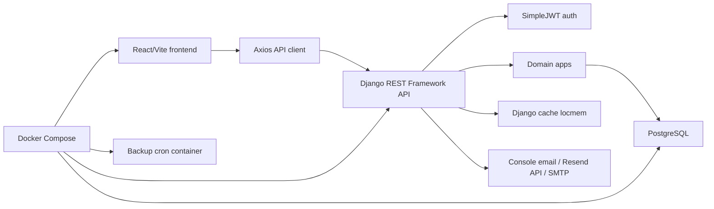
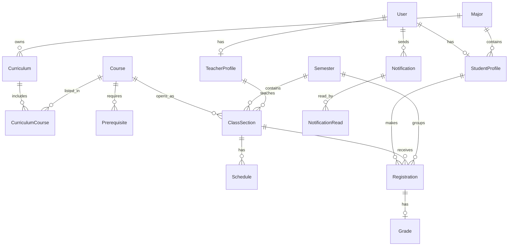
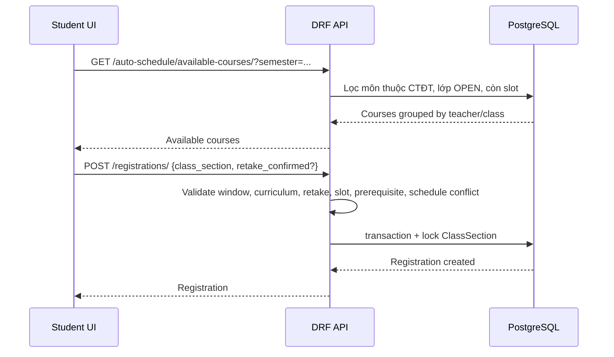

# Reverse Engineering - Hệ thống Đăng ký Môn học

Tài liệu này được reverse engineering từ mã nguồn trong repository `DangKyMonHoc`.
Mục tiêu là giúp người mới nắm được kiến trúc, domain, API, frontend, dữ liệu, vận hành và các ràng buộc nghiệp vụ chính mà không cần đọc toàn bộ từng file trước.

## 1. Tóm tắt hệ thống

Đây là hệ thống đăng ký môn học full-stack cho 3 nhóm người dùng:

- `ADMIN`: quản trị tài khoản, ngành, môn học, chương trình đào tạo, học kỳ, lớp học phần, đăng ký, báo cáo, thông báo.
- `STUDENT`: xem chương trình đào tạo, đăng ký/hủy môn, xem thời khóa biểu, lịch sử đăng ký, điểm, tạo thời khóa biểu tự động, nhận/gửi thông báo phù hợp.
- `TEACHER`: xem lịch dạy, lớp phụ trách, danh sách sinh viên, nhập điểm, gửi thông báo cho lớp.

Stack chính:

- Backend: Django 5.1, Django REST Framework, SimpleJWT, drf-spectacular, PostgreSQL.
- Frontend: React 18, TypeScript, Vite 6, Tailwind CSS, Zustand, Axios, React Router.
- DevOps: Docker Compose dev/prod, Render blueprint, Nginx production frontend, Gunicorn backend, backup PostgreSQL bằng cron container.

## 2. Cấu trúc repository

```text
D:\DangKyMonHoc
├── backend/
│   ├── apps/
│   │   ├── accounts/
│   │   ├── majors/
│   │   ├── courses/
│   │   ├── semesters/
│   │   ├── profiles/
│   │   ├── curriculums/
│   │   ├── classes/
│   │   ├── registrations/
│   │   ├── grades/
│   │   └── notifications/
│   ├── config/
│   ├── data/curriculums/
│   ├── scripts/
│   ├── manage.py
│   ├── requirements.txt
│   └── pytest.ini
├── frontend/
│   ├── src/
│   │   ├── api/
│   │   ├── components/
│   │   ├── lib/
│   │   ├── pages/
│   │   ├── routes/
│   │   ├── stores/
│   │   └── types/
│   ├── package.json
│   └── Dockerfile
├── scripts/backup/
├── doc/
├── docker-compose.yml
├── docker-compose.prod.yml
└── render.yaml
```

## 3. Kiến trúc tổng thể



Backend phục vụ API dưới prefix `/api/`. Frontend gọi API qua `VITE_API_BASE_URL`, mặc định `http://localhost:8000/api`.

Auth là JWT:

1. Login `POST /api/auth/login/`.
2. Frontend lưu `access` và `refresh` trong Zustand persist localStorage.
3. Axios gắn `Authorization: Bearer <access>`.
4. Khi gặp `401`, Axios tự gọi `/api/auth/refresh/`, cập nhật token rồi retry request.
5. Refresh fail thì logout.

## 4. Backend

### 4.1 Django config

Các file chính:

- `backend/config/settings.py`: cài app, DB, JWT, CORS, DRF, cache, email, business constants.
- `backend/config/urls.py`: map toàn bộ API.
- `backend/config/pagination.py`: phân trang chuẩn `25`, tối đa `50`; lookup pagination tối đa `1000`.
- `backend/config/middleware.py`: đo thời gian xử lý request và gắn header `X-Response-Time-Ms`.

Thiết lập đáng chú ý:

- `AUTH_USER_MODEL = "accounts.User"`.
- Authentication mặc định là `LockedAwareJWTAuthentication`, chặn tài khoản bị khóa kể cả khi đã có token.
- Permission mặc định là authenticated.
- JWT access token 60 phút, refresh token 7 ngày, rotate refresh token.
- Business constants:
  - `REGISTRATION_MIN_CREDITS_PER_SEMESTER`
  - `REGISTRATION_MAX_CREDITS_PER_SEMESTER`
  - `REGISTRATION_CANCEL_GRACE_DAYS`
  - `GRADE_UPDATE_GRACE_DAYS`
  - `GRADE_PASSING_SCORE`

### 4.2 Domain model



Các entity chính:

- `accounts.User`: kế thừa `AbstractUser`, thêm `full_name`, `role`, `phone`, `is_locked`.
- `profiles.StudentProfile`: MSSV, ngành, khóa tuyển sinh, GPA, tín chỉ hoàn thành.
- `profiles.TeacherProfile`: mã GV, khoa, học hàm/học vị.
- `majors.Major`: ngành đào tạo, khoa quản lý, thời lượng đào tạo.
- `courses.Course`: mã môn, tên, tín chỉ, số tiết lý thuyết/thực hành, trạng thái active.
- `courses.Prerequisite`: quan hệ môn học và môn tiên quyết.
- `semesters.Semester`: học kỳ, năm học, ngày học, cửa sổ đăng ký, trạng thái mở.
- `curriculums.Curriculum`: CTĐT theo ngành và cohort.
- `curriculums.CurriculumCourse`: môn thuộc CTĐT, khối kiến thức, bắt buộc/tự chọn, học kỳ gợi ý.
- `classes.ClassSection`: lớp học phần, môn, học kỳ, GV, sĩ số, trạng thái.
- `classes.Schedule`: lịch học theo thứ, ca, tiết bắt đầu/kết thúc, phòng, ngày học.
- `registrations.Registration`: đăng ký của sinh viên vào lớp học phần.
- `grades.Grade`: điểm thành phần, điểm tổng, điểm chữ, GPA thang 4.
- `notifications.Notification`: thông báo theo audience hoặc danh sách recipients.
- `notifications.NotificationRead`: đánh dấu đã đọc theo user.

### 4.3 API map

Auth và hệ thống:

| Endpoint | Mục đích |
|---|---|
| `GET /api/health/` | Health check public |
| `POST /api/auth/login/` | Login JWT |
| `POST /api/auth/refresh/` | Refresh JWT |
| `POST /api/auth/forgot-password/` | Gửi PIN reset password |
| `POST /api/auth/reset-password/` | Xác thực PIN và đổi password |
| `GET /api/schema/` | OpenAPI schema |
| `GET /api/docs/` | Swagger UI |
| `GET /api/redoc/` | Redoc |

CRUD/domain:

| Endpoint | App | Ghi chú quyền |
|---|---|---|
| `/api/accounts/users/` | accounts | Admin CRUD; có `me`, `change-password` |
| `/api/majors/` | majors | Auth read, Admin write |
| `/api/courses/` | courses | Auth read, Admin write |
| `/api/prerequisites/` | courses | Auth read, Admin write |
| `/api/semesters/` | semesters | Auth read, Admin write; có `open`, `close` |
| `/api/students/` | profiles | Auth read, Admin write; có `me` |
| `/api/teachers/` | profiles | Auth read, Admin write; có `me` |
| `/api/curriculums/` | curriculums | Auth read, Admin write; có `my` |
| `/api/curriculum-courses/` | curriculums | Auth read, Admin write |
| `/api/class-sections/` | classes | Auth read, Admin write; có `notify` |
| `/api/schedules/` | classes | Auth read, Admin write |
| `/api/registrations/` | registrations | Role-sensitive queryset; có `cancel` |
| `/api/auto-schedule/available-courses/` | registrations | Student-only behavior |
| `/api/auto-schedule/suggest/` | registrations | Gợi ý TKB |
| `/api/grades/` | grades | Role-sensitive queryset |
| `/api/notifications/` | notifications | Role-sensitive list/create |
| `/api/reports/admin-summary/` | accounts/reports | Admin-only |

### 4.4 Quyền truy cập

Permission classes:

- `IsAdminRole`: chỉ `role=ADMIN`.
- `IsTeacherRole`: chỉ `role=TEACHER`.
- `IsStudentRole`: chỉ `role=STUDENT`.
- `IsAdminOrReadOnly`: mọi user đã login được đọc, chỉ Admin được ghi.

Một số rule theo queryset:

- Student chỉ xem registration và grade của chính mình.
- Teacher chỉ xem grade/lớp liên quan đến lớp mình dạy.
- Admin xem toàn bộ.
- Notification lọc theo audience, recipients hoặc sender.

### 4.5 Accounts và bảo mật

Luồng tài khoản:

- Admin tạo được `STUDENT` hoặc `TEACHER`, không tạo Admin qua API.
- Tạo/sửa user đồng bộ profile:
  - Student cần `student_major`, tạo/cập nhật `StudentProfile`.
  - Teacher cần `teacher_department`, tạo/cập nhật `TeacherProfile`.
- Admin có thể reset password user bằng PATCH nếu gửi `password`.
- User tự đổi password qua `/api/accounts/users/change-password/`.
- Tài khoản bị khóa:
  - Không login được.
  - Không dùng access token cũ được.
  - Không refresh token cũ được.

Rate limit:

- Login: tối đa 5 lần/phút/IP, quá ngưỡng khóa 15 phút.
- Forgot password: tối đa 3 request/15 phút/email.

Forgot password:

- Chỉ Student/Teacher.
- Admin không reset qua flow này.
- Tạo PIN 6 số, TTL 10 phút.
- Gửi qua Resend nếu có `RESEND_API_KEY`, ngược lại dùng Django email backend.

### 4.6 Đăng ký môn học

Logic chính nằm trong `backend/apps/registrations/serializers.py` và `views.py`.

Khi tạo registration:

1. Nếu user là Student, backend ép `student = request.user.student_profile`.
2. `semester` được đồng bộ theo `class_section.semester`.
3. Kiểm tra học kỳ đang mở và nằm trong cửa sổ đăng ký.
4. Kiểm tra môn thuộc CTĐT của sinh viên.
5. Nếu sinh viên đã có grade của môn, cần `retake_confirmed=true`.
6. Kiểm tra lớp chưa đầy.
7. Kiểm tra môn tiên quyết đã đạt theo `GRADE_PASSING_SCORE`.
8. Kiểm tra trùng lịch với các registration active hiện có.
9. Tạo trong transaction, lock `ClassSection` bằng `select_for_update`.
10. Re-check sĩ số và duplicate sau khi lock.

Hủy registration:

- Student hủy qua action `cancel`, subject to registration window/grace rule.
- Admin có thể force cancel sau deadline.
- Hủy chuyển status sang `CANCELLED`, ghi `cancelled_at`, `cancel_reason`.
- Signal cập nhật lại `ClassSection.enrolled_count`.

### 4.7 Gợi ý thời khóa biểu tự động

File chính: `backend/apps/registrations/auto_schedule.py`.

Input:

- Học kỳ.
- Danh sách `course_ids`.
- Ngày muốn tránh.
- Ngày ưu tiên.
- Ca học ưu tiên.
- GV ưu tiên.
- Preset ưu tiên.
- Hard constraint GV theo từng môn.
- `max_results`.

Hard constraints:

- Học kỳ phải `is_open`.
- Nếu quá `registration_end` thì chặn.
- Cho phép gợi ý trước `registration_start` để sinh viên chuẩn bị.
- Môn phải tồn tại và thuộc CTĐT.
- Môn chưa có grade.
- Đủ tiên quyết.
- Mỗi môn có ít nhất một lớp `OPEN`, chưa đầy.
- Không trùng lịch giữa các lớp được chọn.
- Không trùng với lịch đã đăng ký.

Thuật toán:

1. Build domain lớp học phần khả thi cho từng môn.
2. Cache schedule theo class section.
3. Sắp xếp môn theo MRV: môn có ít lựa chọn hơn đi trước.
4. Backtracking để sinh các tổ hợp không trùng lịch.
5. Score từng tổ hợp.
6. Sort giảm dần theo score.

Scoring:

- `weekday`: tránh/ngày ưu tiên.
- `session`: ca học ưu tiên.
- `teacher`: GV ưu tiên.
- `free_day`: số ngày nghỉ trong tuần.
- Preset điều chỉnh weight: balanced, teacher first, session first, compact/free-day first, auto.

### 4.8 Lớp học phần và lịch học

Class section:

- Status: `DRAFT`, `OPEN`, `CLOSED`, `CANCELLED`.
- Lớp `OPEN` cần có teacher.
- Không mở lớp trong học kỳ đã đóng.
- Có thể tạo/cập nhật kèm `primary_schedule`; toàn bộ chạy trong transaction.

Schedule:

- Weekday: 0-6 tương ứng Thứ 2 đến Chủ nhật.
- Session:
  - `MORNING`: tiết 1-5.
  - `AFTERNOON`: tiết 6-10.
  - `EVENING`: tiết 11-15.
- `end_period` tự tính từ `start_period + periods_per_session - 1`.
- Validate:
  - Không vượt tiết 15.
  - Tiết phải nằm trong ca.
  - Ngày học nằm trong học kỳ.
  - Phòng không được overlap cùng thời điểm/ngày hiệu lực.
  - GV không được dạy trùng thời điểm/ngày hiệu lực.

### 4.9 Điểm

File chính: `backend/apps/grades/models.py`, `serializers.py`, `views.py`.

Grade là OneToOne với Registration.

Công thức:

```text
total_score = process_score * 10% + midterm_score * 40% + final_score * 50%
```

Quy đổi:

- `A`: >= 8.5
- `B+`: >= 8.0
- `B`: >= 7.0
- `C+`: >= 6.5
- `C`: >= 5.5
- `D+`: >= 5.0
- `D`: >= 4.0
- `F`: < 4.0

GPA thang 4:

- Nếu `total_score < 4.0`: `0.00`.
- Ngược lại: `total_score * 0.4`, làm tròn 2 chữ số.

Quyền:

- Teacher chỉ tạo/sửa điểm cho lớp mình phụ trách.
- Admin bỏ qua kiểm tra ownership và deadline.
- Non-admin bị chặn nếu quá `semester.end_date + GRADE_UPDATE_GRACE_DAYS`.

### 4.10 Thông báo

Notification hỗ trợ:

- Audience: `ALL_STUDENTS`, `ALL_TEACHERS`, `ALL`, `SPECIFIC`.
- Category: `REGISTRATION`, `SCHEDULE`, `CLASS`, `SYSTEM`, `OTHER`.
- Đánh dấu đọc từng notification hoặc tất cả.
- Đếm unread.

Rule tạo:

- Admin tạo được notification rộng hoặc cụ thể.
- Student chỉ gửi được notification `SPECIFIC` cho teacher.
- Student chỉ được gửi cho teacher của lớp mình đã đăng ký `CONFIRMED`.
- Teacher/Admin có thể dùng action `/api/class-sections/{id}/notify/` để gửi thông báo cho toàn bộ sinh viên đã đăng ký lớp.

### 4.11 Báo cáo Admin

Endpoint `GET /api/reports/admin-summary/?semester=<id>` trả:

- Thống kê user theo role và locked.
- Thống kê class section theo status và lớp đầy.
- Registration theo status.
- Top 10 môn có nhiều registration confirmed.
- Registration và số sinh viên theo ngành.
- Registration theo 10 học kỳ gần nhất.
- Tổng ngành active.

## 5. Frontend

### 5.1 Kiến trúc frontend

Các phần chính:

- `src/api/`: wrapper Axios theo từng resource.
- `src/stores/auth.ts`: Zustand persist token/user.
- `src/stores/ui.ts`: trạng thái sidebar.
- `src/routes/ProtectedRoute.tsx`: chặn route theo token/role.
- `src/components/`: Layout, Sidebar, TopBar, NotificationBell, AccountMenu, UI primitives.
- `src/pages/`: màn hình theo role.
- `src/types/`: type domain khớp backend.

Axios client:

- Base URL từ `VITE_API_BASE_URL`.
- Request interceptor gắn access token.
- Response interceptor refresh token khi gặp 401.
- Dùng một `refreshPromise` để tránh nhiều refresh song song.

### 5.2 Route map

Public:

- `/login`: login Student/Teacher.
- `/admin/login`: login Admin.
- `/forgot-password`: reset password bằng email/PIN.

Protected common:

- `/`: redirect theo role.

Admin:

- `/admin`: dashboard.
- `/admin/accounts`: tài khoản.
- `/admin/registrations`: đăng ký.
- `/admin/notifications`: thông báo.
- `/admin/reports`: báo cáo.
- `/admin/profile`: hồ sơ.
- `/admin/majors`: ngành.
- `/admin/courses`: môn.
- `/admin/semesters`: học kỳ.
- `/admin/curriculum`: CTĐT.
- `/admin/curriculum/:id`: chi tiết CTĐT.
- `/admin/classes`: lớp học phần.
- `/admin/classes/:id`: chi tiết lớp.

Student:

- `/student`: dashboard.
- `/student/curriculum`: CTĐT của sinh viên.
- `/student/notifications`: thông báo.
- `/student/profile`: hồ sơ.
- `/student/register`: đăng ký môn.
- `/student/schedule`: thời khóa biểu.
- `/student/history`: lịch sử đăng ký.
- `/student/grades`: bảng điểm.
- `/student/auto`: tạo TKB tự động.

Teacher:

- `/teacher`: dashboard.
- `/teacher/schedule`: lịch dạy.
- `/teacher/classes`: lớp phụ trách.
- `/teacher/classes/:id`: chi tiết lớp.
- `/teacher/grades`: nhập điểm.
- `/teacher/notifications`: thông báo.
- `/teacher/profile`: hồ sơ.

### 5.3 Layout và UX

Layout gồm:

- Sidebar theo role.
- TopBar với breadcrumb.
- NotificationBell.
- AccountMenu.
- IdleLogoutGuard.

Idle logout:

- Timeout 15 phút.
- Warning ở phút 14.
- Theo dõi activity events và lưu last activity qua localStorage key `dkmh:last-activity`.

UI primitives:

- `Button`, `Badge`, `Card`, `Input`, `Modal`, `Pagination`, `ScheduleGrid`, `Stat`, `Table`, `ToastHost`.

### 5.4 Màn hình Admin

Admin có nhóm chức năng:

- Quản lý tài khoản:
  - CRUD student/teacher.
  - Không tạo Admin qua UI/API.
  - Lock/unlock user.
  - Reset password.
  - Filter theo role, locked, khoa, ngành.
- Quản lý ngành, môn, học kỳ, CTĐT, lớp học phần:
  - CRUD metadata học vụ.
  - CTĐT gắn môn với khối kiến thức và học kỳ gợi ý.
  - Lớp học phần gắn môn, học kỳ, teacher, lịch học, sĩ số.
- Quản lý đăng ký:
  - Xem/filter theo học kỳ, lớp, khoa, ngành, status.
  - Hủy mềm registration.
  - Xóa cứng registration cho dữ liệu lỗi/test.
- Thông báo:
  - Tạo notification.
  - Xóa notification.
  - Mark read/all read.
- Báo cáo:
  - Tổng quan user/class/registration.
  - Top môn.
  - Theo ngành.
  - Theo học kỳ.

### 5.5 Màn hình Student

Đăng ký môn:

- Tự chọn học kỳ active hoặc upcoming phù hợp.
- Load các môn khả dụng từ `/auto-schedule/available-courses/`.
- Group lớp học phần theo môn, teacher.
- Hiển thị đã học, passed, thiếu tiên quyết, đã đăng ký, sĩ số.
- Đăng ký bằng `/registrations/`.
- Nếu backend báo môn đã học, UI mở xác nhận học lại rồi gửi `retake_confirmed=true`.
- Hủy registration trong UI bằng action `/registrations/{id}/cancel/`.

Tạo TKB tự động:

- Chọn môn, ngày tránh, ca ưu tiên, GV ưu tiên hoặc khóa GV theo môn.
- Gọi `/auto-schedule/suggest/`.
- Hiển thị candidate kèm score, breakdown, số ngày học/ngày nghỉ.
- Có nút áp dụng để đăng ký các class sections của candidate.

Các màn hình khác:

- Xem CTĐT của bản thân.
- Xem TKB.
- Xem lịch sử đăng ký.
- Xem bảng điểm.
- Xem/gửi notification theo rule.
- Đổi mật khẩu và xem hồ sơ.

### 5.6 Màn hình Teacher

Teacher:

- Xem các lớp mình phụ trách theo học kỳ.
- Xem chi tiết lớp, lịch học, danh sách sinh viên confirmed.
- Gửi thông báo cho toàn bộ sinh viên trong lớp.
- Nhập điểm theo lớp:
  - Load registrations confirmed.
  - Load grades hiện có.
  - UI preview tổng điểm, điểm chữ, GPA.
  - Save từng dòng hoặc save all.
  - Backend vẫn là nguồn tính toán cuối cùng.
- Xem lịch dạy, notification, hồ sơ.

## 6. Dữ liệu seed và import

File dữ liệu:

- `backend/data/curriculums/*.xlsx`: mẫu CTĐT cho các ngành.
- `backend/data/curriculums/generate_sample_xlsx.py`: tạo sample xlsx.

Management command:

- `backend/apps/curriculums/management/commands/import_curriculum_xlsx.py`
- Import CTĐT từ Excel, dùng `openpyxl`.
- Tự đọc header để xác định cột mã môn, tên môn, tín chỉ, bắt buộc, học kỳ gợi ý.

Seed scripts trong `backend/scripts/`:

- Seed user sinh viên/giáo viên.
- Seed teacher.
- Seed class sections.
- Seed class sections từ curriculum.
- Seed prerequisite theo ngành.
- Seed lịch sử đăng ký và điểm.
- Seed notification demo.
- Fix/realign dữ liệu demo.
- Resolve schedule conflicts.

Các script này thường chạy qua:

```powershell
docker compose exec backend python manage.py shell -c "exec(open('/app/scripts/<script>.py', encoding='utf-8').read())"
```

## 7. Test coverage

Repository có khoảng 128 test backend theo `pytest-django`.

Các nhóm test đang có:

- Health check.
- Login, locked user, refresh token, rate limit.
- Forgot/reset password.
- Admin tạo/sửa tài khoản và đồng bộ profile.
- Major/course/curriculum CRUD và filter.
- Semester validate, duplicate code, open/close semester.
- Class schedule validate phòng/GV/date range/transaction rollback.
- Class notification.
- Registration business rules:
  - học kỳ đóng/chưa mở/quá hạn,
  - môn ngoài CTĐT,
  - học lại cần confirm,
  - lớp đầy,
  - tiên quyết,
  - trùng lịch,
  - signal sĩ số,
  - hủy trong/sau deadline,
  - filter theo khoa/ngành.
- Auto schedule:
  - smoke,
  - conflict details,
  - existing registration conflict,
  - môn ngoài CTĐT,
  - đã học,
  - thiếu tiên quyết,
  - lớp đầy,
  - no open class,
  - semester closed/upcoming/past,
  - scoring/preset/teacher constraint,
  - endpoint available courses.
- Grade:
  - teacher chỉ nhập lớp mình,
  - tự tính total/letter/GPA,
  - deadline update.
- Notification:
  - unread filter,
  - student gửi teacher hợp lệ/không hợp lệ.
- Profile:
  - `students/me` trả GPA và completed credits realtime.

Lệnh chạy:

```powershell
cd backend
pytest
```

Frontend có script build/lint:

```powershell
cd frontend
npm run build
npm run lint
```

## 8. Dev và production

Dev bằng Docker Compose từ root:

```powershell
docker compose up -d --build
```

Services dev:

- `db`: PostgreSQL 16, port `5432`.
- `backend`: Django/Gunicorn reload, port `8000`.
- `frontend`: Vite dev server, port `5173`.
- `pgadmin`: port `5050`.
- `backup`: cron backup database.

Production compose:

```powershell
docker compose -f docker-compose.prod.yml --env-file .env.production up -d --build
```

Production:

- Backend chạy migrate, collectstatic, Gunicorn 3 workers.
- Frontend build static và serve bằng Nginx port 80.
- DB PostgreSQL internal.
- Static backend qua WhiteNoise.

Render:

- `render.yaml` tạo service `dkmh-api` ở Singapore.
- Backend rootDir là `backend`.
- Cần nhập `DATABASE_URL` và `CORS_ALLOWED_ORIGINS`.
- Health check `/api/health/`.

Backup:

- `scripts/backup/backup.sh`: `pg_dump | gzip`, retention 7 ngày.
- `scripts/backup/restore.sh`: list/restore file backup, có prompt xác nhận.

## 9. Luồng nghiệp vụ chính

### 9.1 Admin chuẩn bị dữ liệu học vụ

1. Tạo ngành.
2. Import/tạo CTĐT theo ngành và cohort.
3. Tạo môn và tiên quyết.
4. Tạo học kỳ, cấu hình ngày học và cửa sổ đăng ký.
5. Tạo teacher/student account.
6. Tạo lớp học phần cho học kỳ, gán teacher, lịch, phòng, sĩ số.
7. Mở học kỳ và mở lớp.

### 9.2 Student đăng ký môn



### 9.3 Student tạo TKB tự động

1. Chọn học kỳ và môn.
2. Chọn preference.
3. Backend build domain class sections cho từng môn.
4. Backtracking tìm tổ hợp không trùng lịch.
5. Score và trả danh sách candidate.
6. UI hiển thị candidate, sinh viên áp dụng thì tạo nhiều registration.

### 9.4 Teacher nhập điểm

1. Teacher chọn học kỳ và lớp.
2. UI load registrations confirmed và grades.
3. Teacher nhập điểm QT/GK/CK.
4. UI preview total/letter/GPA.
5. Save gọi create/update grade.
6. Backend kiểm tra teacher ownership/deadline và tự tính lại điểm.

## 10. Điểm mạnh của codebase

- Domain được chia app rõ ràng theo nghiệp vụ.
- Business rules đăng ký môn học được test khá dày.
- Có khóa dòng `ClassSection` khi đăng ký để tránh overbook race condition.
- Có signal đồng bộ `enrolled_count`.
- Auto schedule có thuật toán rõ: domain filtering, MRV, backtracking, scoring.
- API có role-sensitive queryset, giảm rủi ro lộ dữ liệu.
- Tài khoản bị khóa bị chặn ở login, token access cũ và refresh.
- Có health check, Docker Compose, production compose, Render blueprint.
- Frontend tổ chức route theo role rõ ràng.

## 11. Rủi ro và điểm cần chú ý

- Cache hiện dùng `LocMemCache`; production nhiều process/instance nên cân nhắc Redis cho rate limit/reset PIN.
- Một số README/output trong terminal có dấu bị mojibake khi đọc bằng PowerShell mặc định, nhưng source file là UTF-8.
- Frontend hiện không thấy test tự động trong `package.json`; chỉ có build/lint.
- Password reset trả 404 khi email không tồn tại. UX tốt, nhưng có tradeoff enumeration; đã giảm rủi ro bằng rate limit.
- `REGISTRATION_MIN_CREDITS_PER_SEMESTER` và `REGISTRATION_MAX_CREDITS_PER_SEMESTER` được khai báo, nhưng rule tín chỉ thực tế trong test cho thấy hệ thống đang cho phép đăng ký không áp giới hạn cứng.
- `Grade.compute_total` ghi chú công thức là tạm theo SRS, nên nếu quy định trường thay đổi cần sửa cả backend và preview frontend.
- Auto schedule giới hạn input course list tối đa 10 môn và max results tối đa 200 để tránh bùng nổ tổ hợp.
- Các seed script chạy trực tiếp qua Django shell, cần thận trọng khi chạy trên dữ liệu thật.

## 12. File nóng khi bảo trì

Backend:

- `backend/apps/registrations/serializers.py`: rule đăng ký môn.
- `backend/apps/registrations/auto_schedule.py`: gợi ý TKB.
- `backend/apps/classes/serializers.py`: validate lịch/phòng/GV.
- `backend/apps/grades/models.py`: công thức điểm.
- `backend/apps/accounts/serializers.py`: user/profile sync.
- `backend/apps/accounts/password_reset.py`: forgot/reset password.
- `backend/config/settings.py`: config bảo mật, JWT, CORS, business constants.

Frontend:

- `frontend/src/api/client.ts`: token/refresh interceptor.
- `frontend/src/App.tsx`: route map.
- `frontend/src/pages/student/RegisterPage.tsx`: đăng ký môn.
- `frontend/src/pages/student/AutoSchedulePage.tsx`: tạo TKB.
- `frontend/src/pages/teacher/GradesPage.tsx`: nhập điểm.
- `frontend/src/pages/admin/AccountsPage.tsx`: quản lý tài khoản.
- `frontend/src/types/domain.ts`: contract frontend với backend.

## 13. Cách đọc tiếp nếu cần đào sâu

Nếu cần hiểu sâu theo từng luồng:

1. Đọc model để hiểu bảng dữ liệu.
2. Đọc serializer để hiểu validate và shape response.
3. Đọc viewset để hiểu quyền/filter/action.
4. Đọc frontend `api/*.ts` để thấy endpoint được dùng ra sao.
5. Đọc page tương ứng để thấy workflow người dùng.
6. Đọc test tương ứng để biết rule nào đã được khóa bằng regression test.

Mapping nhanh:

| Nghiệp vụ | Backend | Frontend | Test |
|---|---|---|---|
| Đăng ký môn | `registrations/serializers.py`, `views.py`, `signals.py` | `student/RegisterPage.tsx`, `api/registrations.ts` | `registrations/tests.py` |
| TKB tự động | `registrations/auto_schedule.py` | `student/AutoSchedulePage.tsx`, `api/autoSchedule.ts` | `registrations/tests_auto_schedule.py` |
| Nhập điểm | `grades/models.py`, `views.py` | `teacher/GradesPage.tsx`, `api/grades.ts` | `grades/tests.py` |
| Lớp học phần | `classes/models.py`, `serializers.py`, `views.py` | `admin/ClassesPage.tsx`, `teacher/ClassesPage.tsx` | `classes/tests.py` |
| Tài khoản | `accounts/serializers.py`, `views.py` | `admin/AccountsPage.tsx`, `stores/auth.ts` | `accounts/tests*.py` |
| Thông báo | `notifications/serializers.py`, `views.py` | `NotificationBell.tsx`, notification pages | `notifications/tests.py` |

