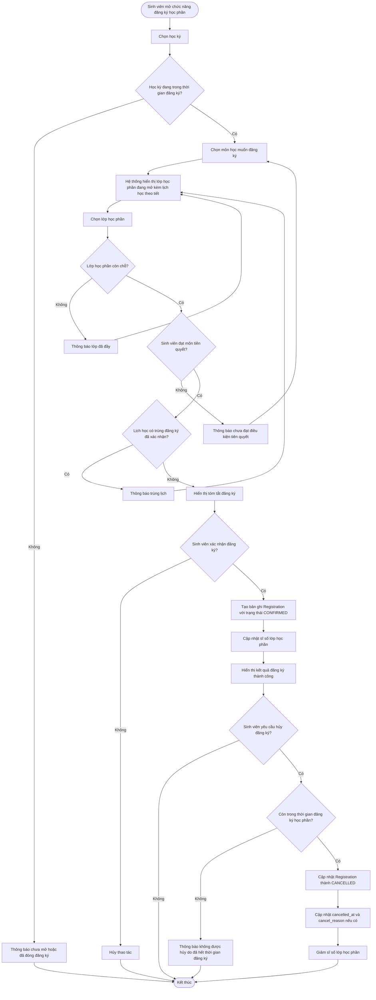
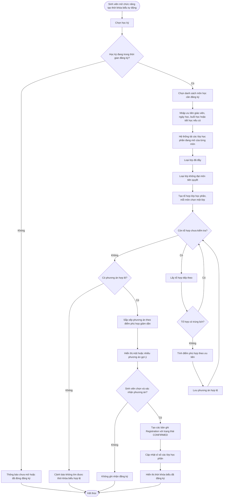

# Software Requirements Specification - Hệ Thống Đăng Ký Môn Học

## 1. Document Information

### 1.1. Metadata

| Attribute     | Value                                                          |
| ------------- | -------------------------------------------------------------- |
| Document Name | Software Requirements Specification - Hệ Thống Đăng Ký Môn Học |
| Document ID   | SRS-DKMH                                                       |
| Project       | Hệ Thống Đăng Ký Môn Học                                       |
| Version       | v1.1                                                           |
| Status        | Draft                                                          |
| Writer        | AI Agent                                                       |
| Reviewer      | TBD                                                            |
| Created Date  | 12/05/2026                                                     |

### 1.2. Revision History

| Version | Date       | Updater  | Changes                                                                                                                              |
| ------- | ---------- | -------- | ------------------------------------------------------------------------------------------------------------------------------------ |
| v0.1    | 12/05/2026 | AI Agent | Chuẩn hóa tài liệu `plan.md` theo `doc/00-standard-for-ai-agent.md`, giữ nguyên các nội dung đã chốt về phạm vi, role và tech stack. |
| v0.2    | 12/05/2026 | AI Agent | Chốt Django REST Framework, Zustand, cách lưu phòng học, quyền tạo tài khoản và chức năng thông báo của Admin.                       |
| v0.3    | 13/05/2026 | AI Agent | Hoàn chỉnh Data Model Draft, bổ sung bảng trường dữ liệu, enum, khóa và quan hệ chính theo backend hiện tại.                         |
| v0.4    | 13/05/2026 | AI Agent | Cập nhật mẫu dữ liệu cho bảng Semester và chuẩn hóa term thành học kỳ 1, 2, 3.                                                       |
| v0.5    | 13/05/2026 | AI Agent | Bổ sung dữ liệu mẫu cho tất cả bảng trong Data Model Draft.                                                                          |
| v0.6    | 13/05/2026 | AI Agent | Cập nhật User full_name, Major duration_years, CurriculumCourse knowledge_block tiếng Việt và Grade gpa_4.                           |
| v0.7    | 13/05/2026 | AI Agent | Cập nhật weekday của Schedule theo định dạng Thứ 2 đến Chủ nhật.                                                                     |
| v0.8    | 13/05/2026 | AI Agent | Cập nhật mô tả category của Notification theo mã enum và nhãn tiếng Việt.                                                            |
| v0.9    | 13/05/2026 | AI Agent | Bổ sung câu trả lời đề xuất cho Open Questions và cập nhật quy định tín chỉ, hủy đăng ký, cập nhật điểm.                             |
| v1.0    | 13/05/2026 | AI Agent | Bổ sung sơ đồ luồng đăng ký học phần và thuật toán tạo thời khóa biểu tự động.                                                       |
| v1.1    | 13/05/2026 | AI Agent | Cập nhật thời khóa biểu theo 15 tiết/ngày và bổ sung số tiết mỗi buổi cho lớp học phần.                                               |

### 1.3. Document Type

Tài liệu này là bản SRS cấp kế hoạch cho hệ thống đăng ký môn học.

DECISION: Tài liệu MUST tuân theo định hướng trong `doc/00-standard-for-ai-agent.md`.

DECISION: Phạm vi tài liệu hiện tại chỉ là SRS, không triển khai HLD/LLD.

TBD: Chưa có file quy ước mã tài liệu chi tiết được tham chiếu bởi `00 #3.1`, nên `Document ID` đang được đặt tạm là `SRS-DKMH`.

## 2. Source Decisions

### 2.1. Scope Decisions

DECISION: Hệ thống MUST hỗ trợ 3 role: `Admin`, `Sinh viên`, `Giáo viên`.

DECISION: Admin MUST quản lý tài khoản, ngành đào tạo, chương trình đào tạo, môn học, học kỳ, lớp học phần và đăng ký môn học.

DECISION: Admin MUST NOT tạo tài khoản Admin.

DECISION: Admin MUST gửi được thông báo cho Sinh viên và Giáo viên.

DECISION: Sinh viên MUST đăng ký môn học và MUST có chức năng tự động tìm kiếm thời khóa biểu phù hợp.

DECISION: Khi đăng ký môn học, Sinh viên MAY chọn giáo viên nếu môn học đó có nhiều giáo viên.

DECISION: Khi đăng ký môn học, Sinh viên MAY chọn ngày học, buổi học hoặc tiết học mong muốn.

DECISION: Giáo viên MUST xem thời khóa biểu cá nhân.

DECISION: Giáo viên MUST nhập điểm cho lớp học phần được phân công.

### 2.2. Technology Decisions

DECISION: Frontend framework MUST sử dụng ReactJS.

DECISION: UI library MUST sử dụng Tailwind CSS.

DECISION: Backend MUST sử dụng Python.

DECISION: Backend framework MUST sử dụng Django REST Framework.

DECISION: State management library MUST sử dụng Zustand.

DECISION: Database MUST sử dụng PostgreSQL.

DECISION: ORM MUST sử dụng TypeORM.

DECISION: API documentation MUST sử dụng Swagger.

DECISION: API testing MUST sử dụng Swagger.

DECISION: Deployment MUST sử dụng Docker.

## 3. System Overview

### 3.1. Purpose

Hệ thống đăng ký môn học hỗ trợ nhà trường quản lý chương trình đào tạo, môn học, học kỳ, lớp học phần và quá trình đăng ký môn học của sinh viên. Hệ thống cũng hỗ trợ sinh viên tự động tìm kiếm thời khóa biểu phù hợp theo môn học, giáo viên, ngày học, buổi học và tiết học mong muốn.

### 3.2. Users and Roles

| Role      | Description                                                                                    |
| --------- | ---------------------------------------------------------------------------------------------- |
| Admin     | Người quản trị hệ thống, chịu trách nhiệm quản lý dữ liệu đào tạo và vận hành đăng ký môn học. |
| Sinh viên | Người học, thực hiện xem chương trình đào tạo, đăng ký môn học và xem thời khóa biểu.          |
| Giáo viên | Người giảng dạy, xem lịch dạy cá nhân, xem lớp học phần được phân công và nhập điểm.           |

### 3.3. Major Business Modules

Hệ thống MUST bao gồm các module chính sau:

- Quản lý tài khoản.
- Quản lý ngành đào tạo.
- Quản lý chương trình đào tạo.
- Quản lý môn học.
- Quản lý học kỳ.
- Quản lý lớp học phần.
- Quản lý đăng ký môn học.
- Tự động tạo thời khóa biểu cho sinh viên.
- Quản lý thời khóa biểu cá nhân của giáo viên.
- Nhập điểm.
- Admin gửi thông báo cho Sinh viên và Giáo viên.
- Báo cáo và thống kê.

DECISION: Hệ thống chỉ lưu phòng học như thuộc tính của lịch học hoặc lớp học phần, không xây dựng module quản lý phòng học chi tiết.

DECISION: Thời khóa biểu MUST dùng 15 tiết trong một ngày: buổi sáng tiết 1-5, buổi chiều tiết 6-10, buổi tối tiết 11-15.

## 4. Functional Requirements

### 4.1. General Requirements

| ID         | Requirement                                                                                   |
| ---------- | --------------------------------------------------------------------------------------------- |
| FR-GEN-001 | Hệ thống MUST cho phép người dùng đăng nhập bằng tài khoản hợp lệ.                            |
| FR-GEN-002 | Hệ thống MUST cho phép người dùng đăng xuất.                                                  |
| FR-GEN-003 | Hệ thống MUST cho phép người dùng đổi mật khẩu.                                               |
| FR-GEN-004 | Hệ thống SHOULD hỗ trợ quên mật khẩu.                                                         |
| FR-GEN-005 | Hệ thống MUST cho phép người dùng xem thông tin cá nhân.                                      |
| FR-GEN-006 | Hệ thống SHOULD cho phép người dùng cập nhật thông tin cá nhân trong phạm vi được phân quyền. |
| FR-GEN-007 | Hệ thống MUST kiểm soát quyền truy cập theo role: Admin, Sinh viên, Giáo viên.                |

### 4.2. Admin Requirements

#### 4.2.1. Quản lý tài khoản

| ID             | Requirement                                           |
| -------------- | ----------------------------------------------------- |
| FR-ADM-ACC-001 | Admin MUST tạo được tài khoản Sinh viên và Giáo viên. |
| FR-ADM-ACC-002 | Admin MUST cập nhật được thông tin tài khoản.         |
| FR-ADM-ACC-003 | Admin MUST khóa và mở khóa được tài khoản.            |
| FR-ADM-ACC-004 | Admin MUST phân quyền người dùng theo role.           |
| FR-ADM-ACC-005 | Admin MUST tìm kiếm và lọc danh sách tài khoản.       |
| FR-ADM-ACC-006 | Admin MUST NOT tạo tài khoản Admin.                   |

#### 4.2.2. Quản lý ngành đào tạo

| ID             | Requirement                                                                        |
| -------------- | ---------------------------------------------------------------------------------- |
| FR-ADM-MAJ-001 | Admin MUST thêm được ngành đào tạo.                                                |
| FR-ADM-MAJ-002 | Admin MUST cập nhật được thông tin ngành đào tạo.                                  |
| FR-ADM-MAJ-003 | Admin MUST xóa hoặc ngừng sử dụng được ngành đào tạo khi thỏa điều kiện nghiệp vụ. |
| FR-ADM-MAJ-004 | Hệ thống MUST hỗ trợ quản lý các ngành như CNTT, KTPM, HTTT, KHMT, ATTT.           |

#### 4.2.3. Quản lý chương trình đào tạo

| ID             | Requirement                                                                                  |
| -------------- | -------------------------------------------------------------------------------------------- |
| FR-ADM-CUR-001 | Admin MUST tạo được chương trình đào tạo cho từng ngành.                                     |
| FR-ADM-CUR-002 | Admin MUST cập nhật được chương trình đào tạo.                                               |
| FR-ADM-CUR-003 | Admin MUST gán môn học vào chương trình đào tạo.                                             |
| FR-ADM-CUR-004 | Admin MUST phân loại môn học trong chương trình đào tạo thành môn bắt buộc hoặc môn tự chọn. |
| FR-ADM-CUR-005 | Admin MUST quản lý được số tín chỉ yêu cầu của chương trình đào tạo.                         |

#### 4.2.4. Quản lý môn học

| ID             | Requirement                                                        |
| -------------- | ------------------------------------------------------------------ |
| FR-ADM-CRS-001 | Admin MUST thêm được môn học.                                      |
| FR-ADM-CRS-002 | Admin MUST cập nhật được thông tin môn học.                        |
| FR-ADM-CRS-003 | Admin MUST xóa hoặc ngừng mở môn học khi thỏa điều kiện nghiệp vụ. |
| FR-ADM-CRS-004 | Admin MUST quản lý được số tín chỉ của môn học.                    |
| FR-ADM-CRS-005 | Admin MUST quản lý được môn học tiên quyết.                        |

#### 4.2.5. Quản lý học kỳ

| ID             | Requirement                                                    |
| -------------- | -------------------------------------------------------------- |
| FR-ADM-SEM-001 | Admin MUST tạo được học kỳ.                                    |
| FR-ADM-SEM-002 | Admin MUST cập nhật được thời gian học kỳ.                     |
| FR-ADM-SEM-003 | Admin MUST mở hoặc đóng học kỳ.                                |
| FR-ADM-SEM-004 | Admin MUST cấu hình được thời gian đăng ký môn học của học kỳ. |

#### 4.2.6. Quản lý lớp học phần

| ID             | Requirement                                                                   |
| -------------- | ----------------------------------------------------------------------------- |
| FR-ADM-CLS-001 | Admin MUST tạo được lớp học phần cho môn học.                                 |
| FR-ADM-CLS-002 | Admin MUST gán được giáo viên giảng dạy cho lớp học phần.                     |
| FR-ADM-CLS-003 | Admin MUST thiết lập được lịch học của lớp học phần.                          |
| FR-ADM-CLS-004 | Admin MUST thiết lập được phòng học của lớp học phần.                         |
| FR-ADM-CLS-005 | Admin MUST thiết lập được số lượng sinh viên tối đa của lớp học phần.         |
| FR-ADM-CLS-006 | Admin MUST cập nhật được thông tin lớp học phần khi thỏa điều kiện nghiệp vụ. |
| FR-ADM-CLS-007 | Admin MUST nhập được số tiết mỗi buổi khi tạo hoặc cập nhật lớp học phần.     |

#### 4.2.7. Quản lý đăng ký môn học

| ID             | Requirement                                                            |
| -------------- | ---------------------------------------------------------------------- |
| FR-ADM-REG-001 | Admin MUST mở được đợt đăng ký môn học.                                |
| FR-ADM-REG-002 | Admin MUST đóng được đợt đăng ký môn học.                              |
| FR-ADM-REG-003 | Admin MUST theo dõi được số lượng sinh viên đăng ký theo lớp học phần. |
| FR-ADM-REG-004 | Hệ thống MUST phát hiện đăng ký bị trùng lịch.                         |
| FR-ADM-REG-005 | Admin MAY hủy đăng ký môn học cho sinh viên khi có lý do hợp lệ.       |
| FR-ADM-REG-006 | Admin MUST xuất được danh sách đăng ký môn học.                        |

#### 4.2.8. Báo cáo và thống kê

| ID             | Requirement                                                           |
| -------------- | --------------------------------------------------------------------- |
| FR-ADM-RPT-001 | Admin MUST xem được thống kê số lượng sinh viên đăng ký theo môn học. |
| FR-ADM-RPT-002 | Admin MUST xem được thống kê số lượng sinh viên đăng ký theo ngành.   |
| FR-ADM-RPT-003 | Admin MUST xem được thống kê lớp học phần đầy hoặc còn chỗ.           |
| FR-ADM-RPT-004 | Admin SHOULD xuất được báo cáo dưới định dạng Excel hoặc PDF.         |

#### 4.2.9. Gửi thông báo

| ID             | Requirement                                  |
| -------------- | -------------------------------------------- |
| FR-ADM-NOT-001 | Admin MUST gửi được thông báo cho Sinh viên. |
| FR-ADM-NOT-002 | Admin MUST gửi được thông báo cho Giáo viên. |

### 4.3. Sinh Viên Requirements

#### 4.3.1. Xem thông tin học tập

| ID             | Requirement                                                        |
| -------------- | ------------------------------------------------------------------ |
| FR-STU-INF-001 | Sinh viên MUST xem được thông tin cá nhân.                         |
| FR-STU-CUR-001 | Sinh viên MUST xem được chương trình đào tạo của ngành đang học.   |
| FR-STU-CUR-002 | Sinh viên MUST xem được danh sách môn học theo ngành.              |
| FR-STU-CUR-003 | Sinh viên MUST phân biệt được môn bắt buộc và môn tự chọn.         |
| FR-STU-CUR-004 | Sinh viên SHOULD xem được tiến độ hoàn thành chương trình đào tạo. |

#### 4.3.2. Xem môn học được đăng ký

| ID             | Requirement                                                                    |
| -------------- | ------------------------------------------------------------------------------ |
| FR-STU-CRS-001 | Sinh viên MUST xem được danh sách môn học được phép đăng ký.                   |
| FR-STU-CRS-002 | Sinh viên MUST lọc được môn học theo học kỳ.                                   |
| FR-STU-CRS-003 | Sinh viên MUST lọc được môn học theo ngành.                                    |
| FR-STU-CRS-004 | Sinh viên MUST xem được thông tin môn học, số tín chỉ và điều kiện tiên quyết. |

#### 4.3.3. Đăng ký môn học thủ công

| ID             | Requirement                                                                     |
| -------------- | ------------------------------------------------------------------------------- |
| FR-STU-REG-001 | Sinh viên MUST chọn được môn học muốn đăng ký.                                  |
| FR-STU-REG-002 | Sinh viên MUST chọn được lớp học phần của môn học.                              |
| FR-STU-REG-003 | Sinh viên MAY chọn giáo viên nếu môn học đó có nhiều giáo viên.                 |
| FR-STU-REG-004 | Sinh viên MAY chọn ngày học, buổi học hoặc tiết học mong muốn.                  |
| FR-STU-REG-005 | Hệ thống MUST kiểm tra trùng lịch trước khi xác nhận đăng ký.                   |
| FR-STU-REG-006 | Hệ thống MUST kiểm tra điều kiện môn học tiên quyết trước khi xác nhận đăng ký. |
| FR-STU-REG-007 | Hệ thống MUST NOT chặn đăng ký theo giới hạn số tín chỉ tối thiểu hoặc tối đa.  |
| FR-STU-REG-008 | Sinh viên MUST xác nhận đăng ký môn học trước khi hệ thống ghi nhận đăng ký.    |
| FR-STU-REG-009 | Sinh viên MAY hủy đăng ký học phần trong thời gian đăng ký học phần.            |

#### 4.3.4. Tự động tạo thời khóa biểu

| ID             | Requirement                                                                                |
| -------------- | ------------------------------------------------------------------------------------------ |
| FR-STU-TKB-001 | Sinh viên MUST chọn được danh sách môn học cần đăng ký để tạo thời khóa biểu tự động.      |
| FR-STU-TKB-002 | Sinh viên MAY chọn giáo viên ưu tiên cho từng môn học.                                     |
| FR-STU-TKB-003 | Sinh viên MAY chọn ngày học ưu tiên.                                                       |
| FR-STU-TKB-004 | Sinh viên MAY chọn buổi học hoặc tiết học ưu tiên.                                          |
| FR-STU-TKB-005 | Hệ thống MUST tự động tìm kiếm thời khóa biểu phù hợp dựa trên các lựa chọn của sinh viên. |
| FR-STU-TKB-006 | Hệ thống SHOULD gợi ý nhiều phương án thời khóa biểu hợp lệ.                               |
| FR-STU-TKB-007 | Hệ thống SHOULD sắp xếp phương án theo mức độ phù hợp với ưu tiên của sinh viên.           |
| FR-STU-TKB-008 | Hệ thống MUST cảnh báo khi không tìm được thời khóa biểu hợp lệ.                           |
| FR-STU-TKB-009 | Sinh viên MUST xác nhận phương án thời khóa biểu trước khi hệ thống ghi nhận đăng ký.      |

#### 4.3.5. Xem thời khóa biểu và lịch sử

| ID             | Requirement                                         |
| -------------- | --------------------------------------------------- |
| FR-STU-SCH-001 | Sinh viên MUST xem được thời khóa biểu theo tuần.   |
| FR-STU-SCH-002 | Sinh viên MUST xem được thời khóa biểu theo học kỳ. |
| FR-STU-SCH-003 | Sinh viên SHOULD xuất được thời khóa biểu.          |
| FR-STU-HIS-001 | Sinh viên MUST xem được lịch sử đăng ký môn học.    |

#### 4.3.6. Nhận thông báo

| ID             | Requirement                                                      |
| -------------- | ---------------------------------------------------------------- |
| FR-STU-NOT-001 | Sinh viên MUST nhận được thông báo mở hoặc đóng đăng ký môn học. |
| FR-STU-NOT-002 | Sinh viên MUST nhận được thông báo khi lịch học thay đổi.        |
| FR-STU-NOT-003 | Sinh viên MUST nhận được thông báo khi lớp học phần bị hủy.      |
| FR-STU-NOT-004 | Sinh viên MUST nhận được thông báo từ Admin.                     |

### 4.4. Giáo Viên Requirements

#### 4.4.1. Xem thông tin và lớp học phần

| ID             | Requirement                                                     |
| -------------- | --------------------------------------------------------------- |
| FR-TEA-INF-001 | Giáo viên MUST xem được thông tin cá nhân.                      |
| FR-TEA-CLS-001 | Giáo viên MUST xem được danh sách lớp học phần được phân công.  |
| FR-TEA-SCH-001 | Giáo viên MUST xem được thời khóa biểu cá nhân.                 |
| FR-TEA-CLS-002 | Giáo viên MUST xem được danh sách sinh viên trong lớp học phần. |
| FR-TEA-CLS-003 | Giáo viên MUST xem được sĩ số lớp.                              |
| FR-TEA-CLS-004 | Giáo viên MUST xem được lịch học và phòng học của lớp học phần. |
| FR-TEA-CLS-005 | Giáo viên MAY gửi thông báo cho sinh viên trong lớp.            |

#### 4.4.2. Nhập điểm

| ID             | Requirement                                                                              |
| -------------- | ---------------------------------------------------------------------------------------- |
| FR-TEA-GRD-001 | Giáo viên MUST nhập được điểm quá trình cho sinh viên trong lớp học phần được phân công. |
| FR-TEA-GRD-002 | Giáo viên MUST nhập được điểm giữa kỳ cho sinh viên trong lớp học phần được phân công.   |
| FR-TEA-GRD-003 | Giáo viên MUST nhập được điểm cuối kỳ cho sinh viên trong lớp học phần được phân công.   |
| FR-TEA-GRD-004 | Giáo viên MUST hoàn thành cập nhật điểm trong vòng 2 tuần sau khi kết thúc môn học.       |
| FR-TEA-GRD-005 | Giáo viên MUST xuất được bảng điểm lớp học phần.                                         |

#### 4.4.3. Khác

| ID             | Requirement                                                      |
| -------------- | ---------------------------------------------------------------- |
| FR-TEA-REQ-001 | Giáo viên MAY đề xuất thay đổi lịch dạy.                         |
| FR-TEA-EXP-001 | Giáo viên MUST xuất được danh sách sinh viên trong lớp học phần. |
| FR-TEA-NOT-001 | Giáo viên MUST nhận được thông báo từ Admin.                     |

## 5. Business Rules

| ID     | Rule                                                                                    |
| ------ | --------------------------------------------------------------------------------------- |
| BR-001 | Hệ thống MUST NOT áp dụng giới hạn số tín chỉ tối thiểu hoặc tối đa cho mỗi học kỳ.     |
| BR-002 | Hệ thống MUST kiểm tra môn học tiên quyết trước khi cho phép sinh viên đăng ký môn học. |
| BR-003 | Hệ thống MUST chỉ cho phép sinh viên đăng ký trong thời gian mở đăng ký.                |
| BR-004 | Hệ thống MUST không cho phép đăng ký nếu lịch học bị trùng.                             |
| BR-005 | Hệ thống MUST không cho phép đăng ký nếu lớp học phần đã đạt số lượng sinh viên tối đa. |
| BR-006 | Hệ thống MUST cho phép sinh viên hủy đăng ký học phần trong thời gian đăng ký học phần. |
| BR-007 | Hệ thống MUST chỉ cho phép giáo viên nhập điểm cho lớp học phần được phân công.         |
| BR-008 | Giáo viên MUST hoàn thành cập nhật điểm trong vòng 2 tuần sau khi kết thúc môn học.     |
| BR-009 | Điểm tổng kết MUST được tính theo công thức: quá trình 10%, giữa kỳ 40%, cuối kỳ 50%.   |
| BR-010 | Thời khóa biểu MUST chia một ngày thành 15 tiết: sáng 1-5, chiều 6-10, tối 11-15.       |
| BR-011 | Khi tạo lớp học phần, Admin MUST nhập số tiết mỗi buổi của lớp học phần.                |

DECISION: Hệ thống không áp dụng kiểm tra số tín chỉ tối thiểu hoặc tối đa trong mỗi kỳ.

DECISION: Sinh viên được phép hủy đăng ký học phần trong thời gian đăng ký học phần.

DECISION: Giáo viên phải hoàn thành cập nhật điểm trong vòng 2 tuần sau khi kết thúc môn học.

DECISION: Điểm tổng kết được tính theo công thức `Final Grade = (Process x 0.1) + (Midterm x 0.4) + (Final Exam x 0.5)`.

DECISION: Lịch học của lớp học phần MUST có tiết bắt đầu và tiết kết thúc nằm trong khoảng 1-15.

## 6. Non-Functional Requirements

| ID          | Requirement                                                                                                  |
| ----------- | ------------------------------------------------------------------------------------------------------------ |
| NFR-PER-001 | Hệ thống SHOULD phản hồi các thao tác tra cứu thông thường trong thời gian chấp nhận được theo tiêu chí TBD. |
| NFR-SEC-001 | Hệ thống MUST xác thực người dùng trước khi truy cập chức năng nội bộ.                                       |
| NFR-SEC-002 | Hệ thống MUST phân quyền theo role Admin, Sinh viên và Giáo viên.                                            |
| NFR-SEC-003 | Hệ thống MUST bảo vệ dữ liệu điểm và dữ liệu cá nhân của người dùng.                                         |
| NFR-AVL-001 | Hệ thống SHOULD có cơ chế sao lưu và phục hồi dữ liệu.                                                       |
| NFR-USA-001 | Giao diện SHOULD dễ sử dụng cho nghiệp vụ đăng ký môn học, xem thời khóa biểu và nhập điểm.                  |
| NFR-SCL-001 | Hệ thống SHOULD có khả năng mở rộng để tăng số lượng sinh viên, môn học và lớp học phần.                     |
| NFR-CMP-001 | Giao diện SHOULD tương thích với các trình duyệt phổ biến.                                                   |

TBD: Chưa có chỉ tiêu định lượng cho hiệu năng, khả dụng, sao lưu và tương thích trình duyệt.

## 7. Data Model Draft

### 7.1. Data Model Scope

Bản nháp dữ liệu này bám theo các model backend hiện tại và các điều chỉnh nghiệp vụ đã chốt trong tài liệu. Các bảng nghiệp vụ SHOULD dùng `id` kiểu `BigAutoField` làm khóa chính mặc định, trừ các bảng trung gian do framework tự sinh cho quan hệ nhiều-nhiều.

Hệ thống SHOULD có các entity dữ liệu sau:

- User.
- StudentProfile.
- TeacherProfile.
- Major.
- Curriculum.
- CurriculumCourse.
- Course.
- Prerequisite.
- Semester.
- ClassSection.
- Schedule.
- Registration.
- Grade.
- Notification.
- NotificationRead.

`Role`, `Status`, `Term`, `Weekday`, `Session`, `KnowledgeBlock`, `Audience` và `Category` SHOULD được lưu dưới dạng enum/choice field thay vì bảng riêng khi không có nhu cầu quản trị động.

### 7.2. Table Fields

#### 7.2.1. User

| Field            | Type            | Key / Constraint      | Description                            | Example Data        |
| ---------------- | --------------- | --------------------- | -------------------------------------- | ------------------- |
| id               | BigAutoField    | PK                    | Định danh tài khoản.                   | 1                   |
| username         | CharField(150)  | Unique, required      | Tên đăng nhập.                         | 24520001            |
| password         | CharField(128)  | Required              | Mật khẩu đã hash.                      | pbkdf2_sha256$...   |
| full_name        | CharField(200)  | Blank allowed         | Họ và tên đầy đủ của người dùng.        | Nguyễn Văn An       |
| email            | EmailField(254) | Blank allowed         | Email người dùng.                      | an.nv24@dkmh.edu.vn |
| role             | CharField(16)   | Enum, default STUDENT | Vai trò: ADMIN, STUDENT, TEACHER.      | STUDENT             |
| phone            | CharField(20)   | Blank allowed         | Số điện thoại.                         | 0901234567          |
| is_locked        | BooleanField    | Default false         | Trạng thái khóa tài khoản nghiệp vụ.   | false               |
| is_active        | BooleanField    | Default true          | Trạng thái hoạt động theo Django auth. | true                |
| is_staff         | BooleanField    | Default false         | Cho phép truy cập Django admin.        | false               |
| is_superuser     | BooleanField    | Default false         | Quyền superuser Django.                | false               |
| last_login       | DateTimeField   | Nullable              | Lần đăng nhập gần nhất.                | 2024-08-20 08:15:00 |
| date_joined      | DateTimeField   | Default current time  | Thời điểm tạo tài khoản.               | 2024-08-01 09:00:00 |
| groups           | ManyToManyField | Blank allowed         | Nhóm quyền Django auth.                | Sinh viên           |
| user_permissions | ManyToManyField | Blank allowed         | Quyền chi tiết Django auth.            | []                  |

#### 7.2.2. StudentProfile

| Field             | Type                 | Key / Constraint   | Description                        | Example Data        |
| ----------------- | -------------------- | ------------------ | ---------------------------------- | ------------------- |
| id                | BigAutoField         | PK                 | Định danh hồ sơ sinh viên.         | 1                   |
| user              | OneToOne(User)       | FK, cascade delete | Tài khoản đăng nhập của sinh viên. | 24520001            |
| student_code      | CharField(16)        | Unique, required   | Mã số sinh viên.                   | 24520001            |
| major             | ForeignKey(Major)    | FK, protect delete | Ngành đào tạo của sinh viên.       | QTKD                |
| enrollment_year   | PositiveSmallInteger | Required           | Khóa tuyển sinh.                   | 2024                |
| gpa               | DecimalField(4,2)    | Default 0.00       | Điểm trung bình tích lũy.          | 3.20                |
| completed_credits | PositiveSmallInteger | Default 0          | Số tín chỉ đã hoàn thành.          | 26                  |
| is_active         | BooleanField         | Default true       | Trạng thái hồ sơ.                  | true                |
| created_at        | DateTimeField        | Auto create        | Thời điểm tạo hồ sơ.               | 2024-08-01 09:05:00 |
| updated_at        | DateTimeField        | Auto update        | Thời điểm cập nhật gần nhất.       | 2024-08-10 10:30:00 |

#### 7.2.3. TeacherProfile

| Field        | Type           | Key / Constraint   | Description                        | Example Data        |
| ------------ | -------------- | ------------------ | ---------------------------------- | ------------------- |
| id           | BigAutoField   | PK                 | Định danh hồ sơ giáo viên.         | 1                   |
| user         | OneToOne(User) | FK, cascade delete | Tài khoản đăng nhập của giáo viên. | GV001               |
| teacher_code | CharField(16)  | Unique, required   | Mã giáo viên.                      | GV001               |
| department   | CharField(200) | Blank allowed      | Khoa hoặc đơn vị công tác.         | Khoa Kinh tế        |
| title        | CharField(80)  | Blank allowed      | Học hàm, học vị hoặc chức danh.    | ThS.                |
| is_active    | BooleanField   | Default true       | Trạng thái hồ sơ.                  | true                |
| created_at   | DateTimeField  | Auto create        | Thời điểm tạo hồ sơ.               | 2024-08-01 09:10:00 |
| updated_at   | DateTimeField  | Auto update        | Thời điểm cập nhật gần nhất.       | 2024-08-10 10:30:00 |

#### 7.2.4. Major

| Field       | Type           | Key / Constraint | Description                  | Example Data                                      |
| ----------- | -------------- | ---------------- | ---------------------------- | ------------------------------------------------- |
| id          | BigAutoField   | PK               | Định danh ngành đào tạo.     | 1                                                 |
| code        | CharField(16)  | Unique, required | Mã ngành.                    | QTKD                                              |
| name        | CharField(200) | Required         | Tên ngành.                   | Quản trị kinh doanh                               |
| department  | CharField(200) | Blank allowed    | Khoa quản lý.                | Khoa Kinh tế                                      |
| duration_years | PositiveSmallInteger | Required | Số năm đào tạo của ngành, ví dụ 4 năm hoặc 5 năm. | 4                                                 |
| description | TextField      | Blank allowed    | Mô tả ngành.                 | Chương trình đại học ngành Quản trị kinh doanh    |
| is_active   | BooleanField   | Default true     | Trạng thái sử dụng.          | true                                              |
| created_at  | DateTimeField  | Auto create      | Thời điểm tạo.               | 2024-08-01 09:00:00                               |
| updated_at  | DateTimeField  | Auto update      | Thời điểm cập nhật gần nhất. | 2024-08-10 10:30:00                               |

#### 7.2.5. Curriculum

| Field                  | Type                 | Key / Constraint         | Description                       | Example Data                  |
| ---------------------- | -------------------- | ------------------------ | --------------------------------- | ----------------------------- |
| id                     | BigAutoField         | PK                       | Định danh chương trình đào tạo.   | 1                             |
| major                  | ForeignKey(Major)    | FK, protect delete       | Ngành áp dụng chương trình.       | QTKD                          |
| code                   | CharField(32)        | Unique, required         | Mã chương trình đào tạo.          | QTKD-2024                     |
| name                   | CharField(200)       | Required                 | Tên chương trình đào tạo.         | CTĐT Quản trị kinh doanh 2024 |
| cohort_year            | PositiveSmallInteger | Required                 | Khóa hoặc năm áp dụng.            | 2024                          |
| total_credits_required | PositiveSmallInteger | Default 145              | Tổng tín chỉ yêu cầu.             | 132                           |
| description            | TextField            | Blank allowed            | Mô tả chương trình.               | Áp dụng cho khóa tuyển sinh 2024 |
| is_active              | BooleanField         | Default true             | Trạng thái sử dụng.               | true                          |
| courses                | ManyToMany(Course)   | Through CurriculumCourse | Danh sách môn trong chương trình. | LING095, LING096              |
| created_at             | DateTimeField        | Auto create              | Thời điểm tạo.                    | 2024-08-01 09:00:00           |
| updated_at             | DateTimeField        | Auto update              | Thời điểm cập nhật gần nhất.      | 2024-08-10 10:30:00           |

#### 7.2.6. CurriculumCourse

| Field              | Type                   | Key / Constraint    | Description                                              | Example Data |
| ------------------ | ---------------------- | ------------------- | -------------------------------------------------------- | ------------ |
| id                 | BigAutoField           | PK                  | Định danh dòng môn học trong CTĐT.                       | 1            |
| curriculum         | ForeignKey(Curriculum) | FK, cascade delete  | Chương trình đào tạo chứa môn học.                       | QTKD-2024    |
| course             | ForeignKey(Course)     | FK, protect delete  | Môn học thuộc chương trình.                              | LING095      |
| knowledge_block    | CharField(32)          | Enum, required      | Khối kiến thức: Chuyên ngành, Đại cương, Tự chọn, Khóa luận tốt nghiệp. | Đại cương    |
| is_required        | BooleanField           | Default true        | Đánh dấu môn bắt buộc hoặc tự chọn.                      | true         |
| suggested_semester | PositiveSmallInteger   | Default 1           | Học kỳ gợi ý.                                            | 1            |

Ràng buộc: `curriculum` và `course` MUST là duy nhất theo cặp để một môn không bị gán trùng trong cùng một chương trình đào tạo.

#### 7.2.7. Course

| Field          | Type                 | Key / Constraint     | Description                  | Example Data        |
| -------------- | -------------------- | -------------------- | ---------------------------- | ------------------- |
| id             | BigAutoField         | PK                   | Định danh môn học.           | 1                   |
| code           | CharField(16)        | Unique, required     | Mã môn học.                  | LING095             |
| name           | CharField(200)       | Required             | Tên môn học.                 | Kinh tế vi mô       |
| credits        | PositiveSmallInteger | Default 3            | Số tín chỉ.                  | 2                   |
| theory_hours   | PositiveSmallInteger | Default 0            | Số tiết lý thuyết.           | 30                  |
| practice_hours | PositiveSmallInteger | Default 0            | Số tiết thực hành.           | 0                   |
| description    | TextField            | Blank allowed        | Mô tả môn học.               | Môn cơ sở ngành     |
| is_active      | BooleanField         | Default true         | Trạng thái sử dụng.          | true                |
| prerequisites  | ManyToMany(Course)   | Through Prerequisite | Danh sách môn tiên quyết.    | []                  |
| created_at     | DateTimeField        | Auto create          | Thời điểm tạo.               | 2024-08-01 09:00:00 |
| updated_at     | DateTimeField        | Auto update          | Thời điểm cập nhật gần nhất. | 2024-08-10 10:30:00 |

#### 7.2.8. Prerequisite

| Field           | Type               | Key / Constraint   | Description                             | Example Data           |
| --------------- | ------------------ | ------------------ | --------------------------------------- | ---------------------- |
| id              | BigAutoField       | PK                 | Định danh quan hệ tiên quyết.           | 1                      |
| course          | ForeignKey(Course) | FK, cascade delete | Môn học cần kiểm tra điều kiện.         | LING096                |
| required_course | ForeignKey(Course) | FK, protect delete | Môn học bắt buộc phải hoàn thành trước. | LING095                |
| note            | CharField(200)     | Blank allowed      | Ghi chú điều kiện tiên quyết.           | Đạt từ điểm D trở lên  |

Ràng buộc: `course` và `required_course` MUST là duy nhất theo cặp.

#### 7.2.9. Semester

| Field              | Type                 | Key / Constraint | Description                                 | Example Data           |
| ------------------ | -------------------- | ---------------- | ------------------------------------------- | ---------------------- |
| id                 | BigAutoField         | PK               | Định danh học kỳ.                           | 1                      |
| code               | CharField(24)        | Unique, required | Mã học kỳ.                                  | 2024-2025-HK1          |
| name               | CharField(200)       | Required         | Tên học kỳ.                                 | Học kỳ 1 năm 2024-2025 |
| term               | PositiveSmallInteger | Enum, required   | Học kỳ trong năm học: 1, 2 hoặc 3.          | 1                      |
| academic_year      | CharField(12)        | Required         | Năm học.                                    | 2024-2025              |
| start_date         | DateField            | Required         | Ngày bắt đầu học kỳ.                        | 2024-09-01             |
| end_date           | DateField            | Required         | Ngày kết thúc học kỳ.                       | 2024-12-31             |
| registration_start | DateTimeField        | Nullable         | Thời điểm mở đăng ký.                       | 2024-08-15 08:00:00    |
| registration_end   | DateTimeField        | Nullable         | Thời điểm đóng đăng ký.                     | 2024-08-30 17:00:00    |
| is_open            | BooleanField         | Default false    | Trạng thái mở đăng ký hoặc vận hành học kỳ. | true                   |
| created_at         | DateTimeField        | Auto create      | Thời điểm tạo.                              | 2024-08-01 09:00:00    |
| updated_at         | DateTimeField        | Auto update      | Thời điểm cập nhật gần nhất.                | 2024-08-10 10:30:00    |

#### 7.2.10. ClassSection

| Field          | Type                       | Key / Constraint       | Description                                 | Example Data        |
| -------------- | -------------------------- | ---------------------- | ------------------------------------------- | ------------------- |
| id             | BigAutoField               | PK                     | Định danh lớp học phần.                     | 1                   |
| code           | CharField(24)              | Unique, required       | Mã lớp học phần.                            | LING095.01          |
| course         | ForeignKey(Course)         | FK, protect delete     | Môn học được mở lớp.                        | LING095             |
| semester       | ForeignKey(Semester)       | FK, protect delete     | Học kỳ mở lớp.                              | 2024-2025-HK1       |
| teacher        | ForeignKey(TeacherProfile) | FK, nullable, set null | Giáo viên phụ trách lớp học phần.           | GV001               |
| periods_per_session | PositiveSmallInteger | Required               | Số tiết mỗi buổi học của lớp học phần.      | 3                   |
| max_students   | PositiveSmallInteger       | Default 50             | Sĩ số tối đa.                               | 60                  |
| enrolled_count | PositiveSmallInteger       | Default 0              | Số sinh viên đã đăng ký.                    | 35                  |
| status         | CharField(12)              | Enum, default DRAFT    | Trạng thái: DRAFT, OPEN, CLOSED, CANCELLED. | OPEN                |
| note           | TextField                  | Blank allowed          | Ghi chú lớp học phần.                       | Lớp đại trà         |
| created_at     | DateTimeField              | Auto create            | Thời điểm tạo.                              | 2024-08-01 09:00:00 |
| updated_at     | DateTimeField              | Auto update            | Thời điểm cập nhật gần nhất.                | 2024-08-10 10:30:00 |

#### 7.2.11. Schedule

| Field         | Type                     | Key / Constraint   | Description                          | Example Data     |
| ------------- | ------------------------ | ------------------ | ------------------------------------ | ---------------- |
| id            | BigAutoField             | PK                 | Định danh lịch học.                  | 1                |
| class_section | ForeignKey(ClassSection) | FK, cascade delete | Lớp học phần có lịch học.            | LING095.01       |
| weekday       | CharField(16)            | Enum, required     | Thứ trong tuần: Thứ 2 đến Chủ nhật.  | Thứ 2            |
| session       | CharField(16)            | Enum, required     | Buổi học: Sáng tiết 1-5, Chiều tiết 6-10, Tối tiết 11-15. | Sáng             |
| start_period  | PositiveSmallInteger     | Required           | Tiết bắt đầu trong ngày, từ 1 đến 15. | 1                |
| end_period    | PositiveSmallInteger     | Auto compute       | Tiết kết thúc, tính từ tiết bắt đầu và số tiết mỗi buổi. | 3                |
| room          | CharField(32)            | Blank allowed      | Phòng học.                           | B4.12            |
| start_date    | DateField                | Nullable           | Ngày bắt đầu lịch học riêng nếu có.  | 2024-09-02       |
| end_date      | DateField                | Nullable           | Ngày kết thúc lịch học riêng nếu có. | 2024-12-23       |

Ràng buộc: `start_period` và `end_period` MUST nằm trong khoảng 1-15. `end_period` SHOULD được tính theo công thức `start_period + periods_per_session - 1`. Một buổi học SHOULD không vượt khỏi nhóm tiết của buổi: Sáng 1-5, Chiều 6-10, Tối 11-15.

#### 7.2.12. Registration

| Field         | Type                       | Key / Constraint      | Description                                | Example Data        |
| ------------- | -------------------------- | --------------------- | ------------------------------------------ | ------------------- |
| id            | BigAutoField               | PK                    | Định danh đăng ký môn học.                 | 1                   |
| student       | ForeignKey(StudentProfile) | FK, cascade delete    | Sinh viên đăng ký.                         | 24520001            |
| class_section | ForeignKey(ClassSection)   | FK, protect delete    | Lớp học phần được đăng ký.                 | LING095.01          |
| semester      | ForeignKey(Semester)       | FK, protect delete    | Học kỳ đăng ký.                            | 2024-2025-HK1       |
| status        | CharField(12)              | Enum, default PENDING | Trạng thái: PENDING, CONFIRMED, CANCELLED. | CONFIRMED           |
| registered_at | DateTimeField              | Auto create           | Thời điểm đăng ký.                         | 2024-08-16 08:30:00 |
| cancelled_at  | DateTimeField              | Nullable              | Thời điểm hủy đăng ký.                     | null                |
| cancel_reason | CharField(200)             | Blank allowed         | Lý do hủy đăng ký.                         | ""                  |

Ràng buộc: `student` và `class_section` MUST là duy nhất theo cặp để một sinh viên không đăng ký trùng cùng một lớp học phần.

#### 7.2.13. Grade

| Field         | Type                   | Key / Constraint       | Description                     | Example Data        |
| ------------- | ---------------------- | ---------------------- | ------------------------------- | ------------------- |
| id            | BigAutoField           | PK                     | Định danh bảng điểm.            | 1                   |
| registration  | OneToOne(Registration) | FK, cascade delete     | Đăng ký môn học được nhập điểm. | 1                   |
| process_score | DecimalField(4,2)      | Nullable               | Điểm quá trình.                 | 8.00                |
| midterm_score | DecimalField(4,2)      | Nullable               | Điểm giữa kỳ.                   | 7.50                |
| final_score   | DecimalField(4,2)      | Nullable               | Điểm cuối kỳ.                   | 8.50                |
| total_score   | DecimalField(4,2)      | Nullable, auto compute | Điểm tổng kết.                  | 8.05                |
| gpa_4         | DecimalField(3,2)      | Nullable, auto compute | GPA thang điểm 4 quy đổi từ điểm tổng kết. | 3.00                |
| grade_letter  | CharField(2)           | Blank allowed          | Điểm chữ: A, B, C, D, F.        | B                   |
| note          | CharField(200)         | Blank allowed          | Ghi chú điểm.                   | Đạt                 |
| updated_at    | DateTimeField          | Auto update            | Thời điểm cập nhật gần nhất.    | 2024-12-30 14:00:00 |

#### 7.2.14. Notification

| Field      | Type             | Key / Constraint       | Description                                                   | Example Data                    |
| ---------- | ---------------- | ---------------------- | ------------------------------------------------------------- | ------------------------------- |
| id         | BigAutoField     | PK                     | Định danh thông báo.                                          | 1                               |
| title      | CharField(200)   | Required               | Tiêu đề thông báo.                                            | Mở đăng ký học kỳ 1             |
| body       | TextField        | Required               | Nội dung thông báo.                                           | Sinh viên đăng ký từ 15/08 đến 30/08. |
| category   | CharField(16)    | Enum, default OTHER    | Loại thông báo: REGISTRATION -> Đăng ký; SCHEDULE -> Thời khóa biểu / Lịch học; CLASS -> Lớp học; SYSTEM -> Hệ thống; OTHER -> Khác / Khác nữa. | REGISTRATION                    |
| audience   | CharField(16)    | Enum, default ALL      | Đối tượng nhận: ALL_STUDENTS, ALL_TEACHERS, ALL, SPECIFIC.    | ALL_STUDENTS                    |
| sender     | ForeignKey(User) | FK, nullable, set null | Người gửi thông báo.                                          | admin                           |
| recipients | ManyToMany(User) | Blank allowed          | Danh sách người nhận cụ thể.                                  | 24520001                        |
| created_at | DateTimeField    | Auto create            | Thời điểm tạo thông báo.                                      | 2024-08-10 08:00:00             |

#### 7.2.15. NotificationRead

| Field        | Type                     | Key / Constraint   | Description                         | Example Data        |
| ------------ | ------------------------ | ------------------ | ----------------------------------- | ------------------- |
| id           | BigAutoField             | PK                 | Định danh trạng thái đọc thông báo. | 1                   |
| notification | ForeignKey(Notification) | FK, cascade delete | Thông báo được đánh dấu đã đọc.     | 1                   |
| user         | ForeignKey(User)         | FK, cascade delete | Người dùng đã đọc thông báo.        | 24520001            |
| read_at      | DateTimeField            | Auto create        | Thời điểm đọc thông báo.            | 2024-08-10 09:15:00 |

Ràng buộc: `notification` và `user` MUST là duy nhất theo cặp để một người dùng chỉ có một bản ghi đã đọc cho mỗi thông báo.

### 7.3. Key Relationships

| Relationship                                 | Description                                                           |
| -------------------------------------------- | --------------------------------------------------------------------- |
| User - StudentProfile                        | Một tài khoản sinh viên MUST có tối đa một hồ sơ sinh viên.           |
| User - TeacherProfile                        | Một tài khoản giáo viên MUST có tối đa một hồ sơ giáo viên.           |
| Major - StudentProfile                       | Một ngành đào tạo MAY có nhiều sinh viên.                             |
| Major - Curriculum                           | Một ngành đào tạo MAY có một hoặc nhiều chương trình đào tạo.         |
| Curriculum - CurriculumCourse - Course       | Một chương trình đào tạo gồm nhiều môn học thông qua bảng trung gian. |
| Course - Prerequisite - Course               | Một môn học MAY có một hoặc nhiều môn tiên quyết.                     |
| Course - ClassSection                        | Một môn học MAY có nhiều lớp học phần.                                |
| Semester - ClassSection                      | Một học kỳ MAY có nhiều lớp học phần.                                 |
| TeacherProfile - ClassSection                | Một giáo viên MAY được phân công nhiều lớp học phần.                  |
| ClassSection - Schedule                      | Một lớp học phần MAY có nhiều lịch học; lịch học lưu phòng học, buổi học và tiết học. |
| StudentProfile - Registration - ClassSection | Sinh viên đăng ký vào lớp học phần thông qua bản ghi đăng ký.         |
| Registration - Grade                         | Một đăng ký môn học MAY có một bản ghi điểm.                          |
| User - Notification                          | Một người dùng MAY gửi nhiều thông báo.                               |
| Notification - User                          | Một thông báo MAY có nhiều người nhận cụ thể.                         |
| Notification - NotificationRead - User       | Hệ thống lưu trạng thái đã đọc thông báo theo từng người dùng.        |

## 8. User Interface Scope

Hệ thống SHOULD có các màn hình chính sau:

- Giao diện đăng nhập.
- Dashboard Admin.
- Dashboard Sinh viên.
- Dashboard Giáo viên.
- Giao diện quản lý tài khoản.
- Giao diện quản lý ngành đào tạo.
- Giao diện quản lý chương trình đào tạo.
- Giao diện quản lý môn học.
- Giao diện quản lý học kỳ.
- Giao diện quản lý lớp học phần.
- Giao diện quản lý đăng ký môn học.
- Giao diện gửi thông báo của Admin.
- Giao diện đăng ký môn học của sinh viên.
- Giao diện tạo thời khóa biểu tự động.
- Giao diện xem thời khóa biểu của sinh viên.
- Giao diện xem thời khóa biểu cá nhân của giáo viên.
- Giao diện nhập điểm.
- Giao diện báo cáo và thống kê.

## 9. Use Cases

| ID         | Use Case                                        |
| ---------- | ----------------------------------------------- |
| UC-ADM-001 | Admin quản lý tài khoản.                        |
| UC-ADM-002 | Admin quản lý ngành đào tạo.                    |
| UC-ADM-003 | Admin quản lý chương trình đào tạo.             |
| UC-ADM-004 | Admin quản lý môn học.                          |
| UC-ADM-005 | Admin quản lý học kỳ.                           |
| UC-ADM-006 | Admin quản lý lớp học phần.                     |
| UC-ADM-007 | Admin quản lý đăng ký môn học.                  |
| UC-ADM-008 | Admin gửi thông báo cho Sinh viên và Giáo viên. |
| UC-STU-001 | Sinh viên đăng ký môn học thủ công.             |
| UC-STU-002 | Sinh viên tạo thời khóa biểu tự động.           |
| UC-STU-003 | Sinh viên hủy đăng ký môn học.                  |
| UC-STU-004 | Sinh viên xem thời khóa biểu.                   |
| UC-TEA-001 | Giáo viên xem lớp học phần được phân công.      |
| UC-TEA-002 | Giáo viên xem thời khóa biểu cá nhân.           |
| UC-TEA-003 | Giáo viên nhập điểm.                            |
| UC-TEA-004 | Giáo viên gửi thông báo cho sinh viên.          |

## 10. Technology Stack

| Layer              | Decision                  |
| ------------------ | ------------------------- |
| Frontend framework | ReactJS                   |
| UI library         | Tailwind CSS              |
| State management   | Zustand                   |
| Backend language   | Python                    |
| Backend framework  | Django REST Framework     |
| API style          | RESTful API               |
| Authentication     | JWT, refresh token        |
| Authorization      | Role-based access control |
| Database           | PostgreSQL                |
| ORM                | TypeORM                   |
| API documentation  | Swagger                   |
| Deployment         | Docker                    |
| Version control    | Git, GitHub               |
| API testing        | Swagger                   |

## 11. Verification Plan

| ID       | Verification Scope                                                       |
| -------- | ------------------------------------------------------------------------ |
| TEST-001 | Test đăng nhập, đăng xuất, đổi mật khẩu và phân quyền theo role.         |
| TEST-002 | Test chức năng quản lý tài khoản của Admin.                              |
| TEST-003 | Test chức năng quản lý chương trình đào tạo.                             |
| TEST-004 | Test chức năng quản lý môn học và môn tiên quyết.                        |
| TEST-005 | Test chức năng quản lý học kỳ và thời gian đăng ký.                      |
| TEST-006 | Test chức năng quản lý lớp học phần, số tiết mỗi buổi và lịch học theo tiết. |
| TEST-007 | Test chức năng đăng ký môn học thủ công.                                 |
| TEST-008 | Test kiểm tra trùng lịch, môn tiên quyết và sĩ số lớp.                   |
| TEST-009 | Test thuật toán tạo thời khóa biểu tự động theo ngày, buổi học và tiết học. |
| TEST-010 | Test chức năng xem thời khóa biểu của sinh viên.                         |
| TEST-011 | Test chức năng xem thời khóa biểu cá nhân của giáo viên.                 |
| TEST-012 | Test chức năng nhập điểm, công thức điểm tổng kết và thời hạn cập nhật điểm của giáo viên. |
| TEST-013 | Test chức năng Admin gửi thông báo và người nhận xem thông báo.          |
| TEST-014 | Test báo cáo và thống kê.                                                |

## 12. Open Questions, Assumptions and Risks

### 12.1. Open Questions — Proposed Answers

OPEN QUESTION: Reviewer cần cung cấp quy định cụ thể về số tín chỉ tối thiểu, số tín chỉ tối đa, thời hạn hủy đăng ký và thời hạn cập nhật điểm.

ANSWER: Số tín chỉ tối thiểu và tối đa trong mỗi kỳ không cần quan tâm. Sinh viên được phép hủy đăng ký học phần trong thời gian đăng ký học phần. Giáo viên phải hoàn thành cập nhật điểm trong vòng 2 tuần sau khi kết thúc môn học.

OPEN QUESTION: Reviewer cần xác nhận cách tính điểm tổng kết từ điểm quá trình, giữa kỳ và cuối kỳ.

ANSWER: Điểm tổng kết được tính theo công thức:

- Điểm quá trình: 10%.
- Điểm giữa kỳ: 40%.
- Điểm cuối kỳ: 50%.

Công thức:

`Final Grade = (Process x 0.1) + (Midterm x 0.4) + (Final Exam x 0.5)`

### 12.2. Assumptions

ASSUMPTION: Hệ thống sử dụng RESTful API để frontend ReactJS giao tiếp với backend Python.

ASSUMPTION: Tài khoản Sinh viên và Giáo viên được Admin tạo hoặc nhập từ nguồn dữ liệu nhà trường.

ASSUMPTION: Một môn học có thể có nhiều lớp học phần và nhiều giáo viên giảng dạy thông qua các lớp học phần khác nhau.

### 12.3. Risks

RISK: Thuật toán tự động tạo thời khóa biểu có thể phức tạp nếu số lượng môn học, giáo viên, phòng học và ràng buộc ưu tiên tăng cao.

RISK: Nếu quy định nghiệp vụ về môn tiên quyết, thời hạn đăng ký và thời hạn cập nhật điểm thay đổi, hệ thống có thể cần điều chỉnh logic xử lý tương ứng.

## 13. Appendix

TBD: Sơ đồ use case.

TBD: Sơ đồ ERD.

### 13.3. Sơ đồ luồng xử lý đăng ký môn học

Ghi chú:

- Luồng đăng ký MUST kiểm tra thời gian đăng ký, môn tiên quyết, trùng lịch và sĩ số lớp học phần.
- Trùng lịch MUST được xác định theo thứ trong tuần và khoảng tiết học `start_period` đến `end_period`.
- Luồng đăng ký MUST NOT kiểm tra hoặc chặn theo giới hạn số tín chỉ tối thiểu/tối đa.
- Sinh viên chỉ được hủy đăng ký học phần trong thời gian đăng ký học phần.

### 13.4. Sơ đồ thuật toán tạo thời khóa biểu tự động

Ghi chú:

- Mỗi phương án hợp lệ MUST chọn đúng một lớp học phần cho mỗi môn sinh viên đã chọn.
- Phương án hợp lệ MUST không trùng lịch theo khoảng tiết học, không vi phạm môn tiên quyết và không chọn lớp đã đầy.
- Điểm phù hợp SHOULD ưu tiên giáo viên, ngày học, buổi học và tiết học theo lựa chọn của sinh viên.

TBD: Mẫu báo cáo và biểu mẫu.
